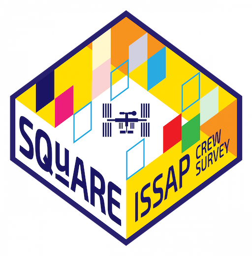

# SQuARE-notebooks
Sampling Quadrangle Assemblages Research Experiment (SQuARE) computational notebooks

See [our blog post](https://issarchaeology.org/space-archaeology-for-real/).

_The SQuARE mission patch, designed by @cheatlines. As she explains: “It’s a test trench made of tape with little color card squares representing the presence and absence of objects.”_
